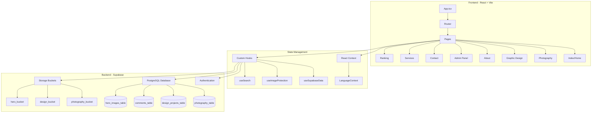
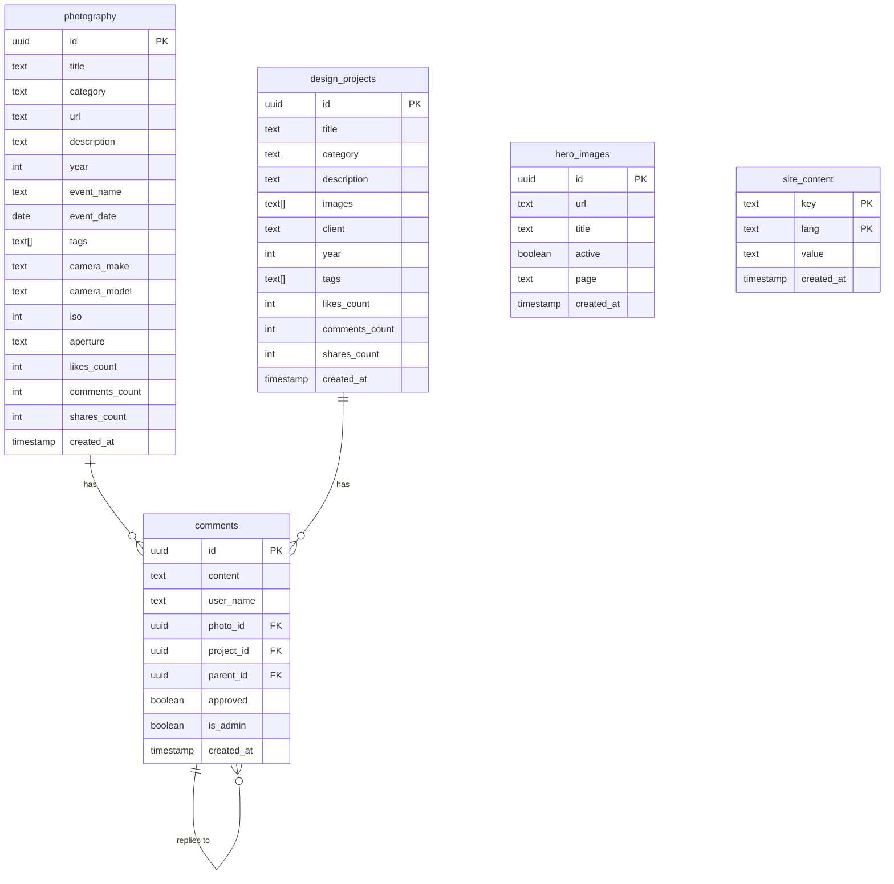

# Documentação Técnica Completa
## Portfolio de Fotografia - Tiago Damasceno

---

## 📋 Índice

1. [Visão Geral do Projeto](#1-visão-geral-do-projeto)
2. [Arquitetura do Sistema](#2-arquitetura-do-sistema)
3. [Stack Tecnológica](#3-stack-tecnológica)
4. [Estrutura do Código](#4-estrutura-do-código)
5. [Componentes Principais](#5-componentes-principais)
6. [Hooks Customizados](#6-hooks-custom izados)
7. [Backend e Banco de Dados](#7-backend-e-banco-de-dados)
8. [Funcionalidades Implementadas](#8-funcionalidades-implementadas)
9. [Configuração e Deploy](#9-configuração-e-deploy)
10. [Histórico de Desenvolvimento](#10-histórico-de-desenvolvimento)

---

## 1. Visão Geral do Projeto

### 1.1 Descrição
Portfolio profissional de fotografia e design gráfico desenvolvido para **Tiago Damasceno**. A aplicação é uma plataforma web moderna que exibe trabalhos de fotografia em diferentes categorias (retratos, urbano, natureza, arte, eventos) e projetos de design gráfico (branding, editorial, web, ilustração, packaging).

### 1.2 Objetivos
- Apresentar portfólio fotográfico de forma elegante e profissional
- Permitir gerenciamento de conteúdo via painel administrativo
- Oferecer experiência interativa com sistema de curtidas, compartilhamentos e comentários
- Suportar internacionalização (PT-BR e EN)
- Proteger imagens  contra download não autorizado
- Otimizado para SEO e performance

### 1.3 Público-Alvo
- Clientes potenciais buscando serviços de fotografia
- Recrutadores e empresas
- Visitantes interessados em trabalhos fotográficos e design

---

## 2. Arquitetura do Sistema

### 2.1 Arquitetura Geral



### 2.2 Fluxo de Dados

1. **Usuário** acessa página → **React Router** determina rota
2. **Página/Componente** solicita dados via **Custom Hook**
3. **Hook** faz requisição ao **Supabase**
4. **Supabase ** retorna dados (após validar RLS policies)
5. **Componente** renderiza dados no UI
6. **Interações do usuário** (likes, comments) → Update no Supabase
7. **Real-time updates** (opcional) via Supabase Realtime

---

## 3. Stack Tecnológica

### 3.1 Frontend

| Tecnologia | Versão | Propósito |
|------------|--------|-----------|
| **React** | 18.3.1 | Framework principal UI |
| **TypeScript** | 5.8.3 | Tipagem estática |
| **Vite** | 5.4.19 | Build tool e dev server |
| **React Router DOM** | 6.30.1 | Roteamento SPA |
| **Tailwind CSS** | 3.4.17 | Estilização utility-first |
| **shadcn/ui** | - | Componentes UI (Radix UI) |
| **Lucide React** | 0.462.0 | Ícones SVG |

### 3.2 Backend/Database

| Tecnologia | Propósito |
|------------|-----------|
| **Supabase** | Backend-as-a-Service |
| **PostgreSQL** | Banco de dados relacional |
| **Supabase Storage** | Armazenamento de imagens |
| **Supabase Auth** | Autenticação de administradores |
| **Row Level Security (RLS)** | Controle de acesso granular |

### 3.3 Bibliotecas Adicionais

| Biblioteca | Propósito |
|------------|-----------|
| **exifr** | Extração de metadados EXIF de fotos |
| **react-helmet-async** | Gerenciamento de meta tags SEO |
| **embla-carousel-react** | Carrosséis de imagens |
| **react-hook-form** | Gerenciamento de formulários |
| **zod** | Validação de schemas |
| **date-fns** | Manipulação de datas |
| **@tanstack/react-query** | Cache e sincronização de dados |

---

## 4. Estrutura do Código

### 4.1 Estrutura de Diretórios

```
Portifolio/
├── src/
│   ├── pages/              # Páginas principais da aplicação
│   │   ├── Index.tsx       # Página inicial
│   │   ├── Photography.tsx # Galeria de fotografias
│   │   ├── GraphicDesign.tsx # Portfólio de design
│   │   ├── AboutPage.tsx   # Sobre o fotógrafo  
│   │   ├── Admin.tsx       # Painel administrativo  
│   │   ├── Contact.tsx     # Página de contato
│   │   ├── Services.tsx    # Serviços oferecidos
│   │   ├── Ranking.tsx     # Ranking de trabalhos
│   │   └── NotFound.tsx    # Página 404
│   │
│   ├── components/         # Componentes reutilizáveis
│   │   ├── ui/             # Componentes shadcn/ui (49 componentes)
│   │   ├── Hero.tsx        # Banner hero
│   │   ├── Navigation.tsx  # Barra de navegação
│   │   ├── Footer.tsx      # Rodapé
│   │   ├── PhotoGrid.tsx   # Grade de fotos
│   │   ├── DesignGrid.tsx  # Grade de projetos
│   │   ├── Lightbox.tsx    # Visualização de imagem expandida
│   │   ├── CommentsSection.tsx # Sistema de comentários
│   │   ├── InteractionBar.tsx  # Likes/shares/comments
│   │   ├── RankingSection.tsx  # Seção de ranking
│   │   ├── ProtectedImage.tsx  # Proteção de imagens
│   │   ├── SearchBar.tsx   # Busca
│   │   ├── LanguageSelector.tsx # Seletor de idioma
│   │   ├── BatchUpload.tsx  # Upload múltiplo
│   │   ├── AllCommentsManagement.tsx # Gerenciamento de comentários
│   │   └── ...
│   │
│   ├── hooks/              # Custom React Hooks
│   │   ├── useSupabaseData.ts    # Integração com Supabase
│   │   ├── useImageProtection.ts # Proteção de imagens
│   │   ├── useSearch.ts          # Funcionalidade de busca
│   │   ├── use-toast.ts          # Sistema de notificações
│   │   └── use-mobile.tsx        # Detecção de mobile
│   │
│   ├── contexts/           # React Contexts
│   │   └── LanguageContext.tsx   # Contexto de internacionalização
│   │
│   ├── lib/                # Utilitários e configurações
│   │   ├── supabase.ts     # Cliente e tipos Supabase
│   │   ├── utils.ts        # Funções utilitárias
│   │   └── exifExtractor.ts # Extração de EXIF
│   │
│   ├── App.tsx             # Componente raiz
│   ├── main.tsx            # Entry point
│   └── index.css           # Estilos globais
│
├── public/                 # Arquivos estáticos
├── *.sql                   # Scripts de migração/configuração DB
├── package.json            # Dependências e scripts
├── vite.config.ts          # Configuração Vite
├── tailwind.config.ts      # Configuração Tailwind
├── tsconfig.json           # Configuração TypeScript
└── README.md               # Documentação básica
```

### 4.2 Contagem de Arquivos

- **Páginas**: 9 arquivos
- **Componentes**: 21 componentes customizados + 49 componentes UI = **70 componentes**
- **Hooks**: 5 custom hooks
- **Contextos**: 1 contexto principal
- **Scripts SQL**: ~30 arquivos de migração e configuração

---

## 5. Componentes Principais

### 5.1 Páginas

#### `Index.tsx` - Página Inicial
- **Propósito**: Landing page com hero banner e preview de trabalhos
- **Funcionalidades**:
  - Hero carousel com imagens em destaque
  - Seção "Sobre"
  - Preview de fotografias e projetos de design
  - CTA para serviços

#### `Photography.tsx` - Galeria de Fotografias
- **Propósito**: Exibir portfólio fotográfico completo  
- **Funcionalidades**:
  - Filtros por categoria (retratos, urbano, natureza, arte, eventos)
  - Busca por título, descrição, tags
  - Lightbox para visualização ampliada
  - Sistema de likes, compartilhamentos e comentários
  - Exibição de metadados EXIF
  - Proteção contra download

#### `GraphicDesign.tsx` - Portfólio de Design
- **Propósito**: Showcase de projetos de design gráfico
- **Funcionalidades**:
  - Filtros por categoria
  - Modal de projeto com múltiplas imagens
  - Informações do cliente e ano
  - Sistema de interação social

#### `Admin.tsx` - Painel Administrativo
- **Propósito**: Gerenciamento de conteúdo (CRUD)
- **Funcionalidades**:
  - Autenticação via Supabase Auth
  - Upload de fotografias com extração automática de EXIF  
  - Upload de projetos de design (múltiplas imagens)
  - Gerenciamento de imagens hero
  - Moderação de comentários
  - Gerenciamento de conteúdo do site
  - Batch upload (upload em lote)
  - Interface traduzida para PT-BR

### 5.2 Componentes de UI

#### `Navigation.tsx` - Navegação Principal
```typescript
// Navegação responsiva com menu mobile
- Links: Home, Photography, Design, About, Services, Contact
- Seletor de idioma
- Modo escuro/claro (via next-themes)
- Menu hamburger em mobile
```

#### `Hero.tsx` - Banner Hero
```typescript
// Carousel de imagens hero vindas do Supabase
- Auto-play
- Fade transition
- Controles de navegação
- Imagens gerenciadas via Admin
```

#### `PhotoGrid.tsx` - Grade de Fotos
```typescript
// Grid responsivo de fotografias
- Layout Masonry/Grid
- Lazy loading de imagens
- Click para lightbox
- Exibição de categoria e título
- Interação: likes, comments, shares
```

#### `CommentsSection.tsx` - Sistema de Comentários
```typescript
// Área de comentários com moderação
- Form para novo comentário
- Lista de comentários aprovados
- Suporte a respostas (threads)
- Indicador de comentário do admin
- Aprovação necessária antes de exibição pública
```

#### `ProtectedImage.tsx` - Proteção de Imagens
```typescript
// Componente que protege imagens contra download
- Desabilita click direito
- Previne arrastar imagem
- Watermark opcional
- Mensagem de proteção
```

#### `Lightbox.tsx` - Visualizador de Imagens
```typescript
// Modal para visualização ampliada
- Navegação entre imagens
- Zoom
- Exibição de metadados (EXIF, título, descrição)
- Fechar com ESC ou click fora
```

#### `InteractionBar.tsx` - Barra de Interação
```typescript
// Botões de like, share, comment
- Contadores em tempo real
- Animações ao clicar
- Persistência no banco de dados
```

### 5.3 Componentes Admin

#### `BatchUpload.tsx` - Upload em Lote
- Upload múltiplo de arquivos
- Extração automática de EXIF  
- Preview de imagens
- Progress bar
- Validação de tipos de arquivo

#### `AllCommentsManagement.tsx` - Gerenciamento de Comentários
- Lista todos os comentários (aprovados e pendentes)
- Filtros por status
- Deletar comentários
- Responder como admin
- Exibição de threads (respostas aninhadas)

---

## 6. Hooks Customizados

### 6.1 `useSupabaseData.ts`

Hook principal para integração com Supabase. Fornece funções para buscar e manipular dados.

```typescript
// Principais exports:

// 1. usePhotography - Buscar fotografias
const { photos, loading, refresh } = usePhotography(category?: string)

// 2. useDesignProjects - Buscar projetos de design
const { projects, loading, refresh } = useDesignProjects(category?: string)

// 3. useComments - Gerenciar comentários de um item
const { comments, loading, addComment, refresh } = useComments(
  itemId: string, 
  type: 'photography' | 'design'
)

// 4. useAuth - Autenticação
const { user, loading, signIn, signOut } = useAuth()

// 5. useAdminComments - Moderação de comentários (admin)
const { pendingComments, loading, approveComment, rejectComment, refresh } = useAdminComments()

// 6. useAllComments - Todos os comentários (admin)
const { allComments, loading, refresh } = useAllComments()

// 7. useTopRated - Rankings
const { topPhotos, topProjects, loading } = useTopRated(limit?)

// Funções auxiliares:
incrementLikes(id: string, type: 'photography' | 'design')
incrementShares(id: string, type: 'photography' | 'design')
deleteComment(id: string)
addReply(parentId: string, content: string, itemId: string, type)
```

**Implementação**:
- 368 linhas de código
- 25 funções/hooks exportados
- Integração com Row Level Security (RLS)
- Tratamento de erros
- Shuffle algorithm para randomização

### 6.2 `useImageProtection.ts`

Protege imagens contra download não autorizado.

```typescript
const useImageProtection = () => {
  // Previne click direito em imagens
  // Previne arrastar imagens
  // Adiciona event listeners em mount
  // Remove em unmount
}
```

### 6.3 `useSearch.ts`

Implementa funcionalidade de busca.

```typescript
const useSearch = (items: T[], searchKeys: (keyof T)[]) => {
  const [searchTerm, setSearchTerm] = useState('')
  const filteredItems = // ... lógica de filtro
  
  return { searchTerm, setSearchTerm, filteredItems }
}
```

### 6.4 `use-toast.ts`

Sistema de notificações toast (shadcn/ui).

### 6.5 `use-mobile.tsx`

Detecta se está em dispositivo móvel via media query.

---

## 7. Backend e Banco de Dados

### 7.1 Configuração Supabase

**URL do Projeto**: Configurado via variável de ambiente `VITE_SUPABASE_URL`  
**Anon Key**: Configurado via `VITE_SUPABASE_ANON_KEY`

### 7.2 Schema do Banco de Dados

#### Tabela: `photography`

```sql
CREATE TABLE photography (
  id UUID PRIMARY KEY DEFAULT gen_random_uuid(),
  title TEXT NOT NULL,
  category TEXT CHECK (category IN ('portraits', 'urban', 'nature', 'art', 'events')),
  url TEXT NOT NULL,
  description TEXT,
  year INTEGER,
  event_name TEXT,
  event_date DATE,
  tags TEXT[],
  
  -- Metadados EXIF
  camera_make TEXT,
  camera_model TEXT,
  lens_model TEXT,
  iso INTEGER,
  aperture TEXT,
  shutter_speed TEXT,
  focal_length TEXT,
  capture_date TIMESTAMP,
  
  -- Contadores sociais
  likes_count INTEGER DEFAULT 0,
  comments_count INTEGER DEFAULT 0,
  shares_count INTEGER DEFAULT 0,
  
  created_at TIMESTAMPTZ NOT NULL DEFAULT NOW(),
  updated_at TIMESTAMPTZ DEFAULT NOW()
);
```

#### Tabela: `design_projects`

```sql
CREATE TABLE design_projects (
  id UUID PRIMARY KEY DEFAULT gen_random_uuid(),
  title TEXT NOT NULL,
  category TEXT CHECK (category IN ('branding', 'editorial', 'web', 'illustration', 'packaging')),
  description TEXT NOT NULL,
  images TEXT[] NOT NULL,  -- Array de URLs
  client TEXT,
  year INTEGER,
  link TEXT,
  event_name TEXT,
  event_date DATE,
  tags TEXT[],
  
  -- Contadores sociais
  likes_count INTEGER DEFAULT 0,
  comments_count INTEGER DEFAULT 0,
  shares_count INTEGER DEFAULT 0,
  
  created_at TIMESTAMPTZ NOT NULL DEFAULT NOW(),
  updated_at TIMESTAMPTZ DEFAULT NOW()
);
```

#### Tabela: `comments`

```sql
CREATE TABLE comments (
  id UUID PRIMARY KEY DEFAULT gen_random_uuid(),
  content TEXT NOT NULL,
  user_name TEXT NOT NULL DEFAULT 'Anonymous',
  photo_id UUID REFERENCES photography(id) ON DELETE CASCADE,
  project_id UUID REFERENCES design_projects(id) ON DELETE CASCADE,
  parent_id UUID REFERENCES comments(id) ON DELETE CASCADE,  -- Para respostas
  approved BOOLEAN DEFAULT FALSE,
  is_admin BOOLEAN DEFAULT FALSE,
  created_at TIMESTAMPTZ NOT NULL DEFAULT NOW()
);
```

#### Tabela: `hero_images`

```sql
CREATE TABLE hero_images (
  id UUID PRIMARY KEY DEFAULT gen_random_uuid(),
  url TEXT NOT NULL,
  title TEXT NOT NULL,
  active BOOLEAN DEFAULT TRUE,
  page TEXT,  -- 'home', 'photography', 'design', etc.
  created_at TIMESTAMPTZ NOT NULL DEFAULT NOW()
);
```

### 7.3 Row Level Security (RLS) Policies

#### Leitura Pública
Todas as tabelas permitem leitura pública para exibição no site:

```sql
CREATE POLICY "Permitir leitura pública"
ON [table_name] FOR SELECT
USING (true);
```

#### Escrita Apenas para Autenticados
Inserção, atualização e deleção requerem autenticação:

```sql
CREATE POLICY "Apenas autenticados podem inserir"
ON [table_name] FOR INSERT
WITH CHECK (auth.role() = 'authenticated');

CREATE POLICY "Apenas autenticados podem atualizar"
ON [table_name] FOR UPDATE
USING (auth.role() = 'authenticated');

CREATE POLICY "Apenas autenticados podem deletar"
ON [table_name] FOR DELETE
USING (auth.role() = 'authenticated');
```

#### Comentários - Aprovação
```sql
-- Apenas comentários aprovados são visíveis publicamente
CREATE POLICY "Leitura apenas comentários aprovados"
ON comments FOR SELECT
USING (approved = TRUE OR auth.role() = 'authenticated');
```

### 7.4 Storage (Buckets)

#### Bucket: `photography`
- **Visibilidade**: Público
- **Propósito**: Armazenar imagens de fotografia
- **Políticas**:
  - Leitura pública: Permitida
  - Upload: Apenas autenticados
  - Deleção: Apenas autenticados

#### Bucket: `design`
- **Visibilidade**: Público
- **Propósito**: Armazenar imagens de projetos de design
- **Políticas**: Idênticas ao bucket `photography`

#### Bucket: `hero`
- ** Visibilidade**: Público
- **Propósito**: Armazenar imagens para banners hero
- **Políticas**: Idênticas aos demais

### 7.5 Triggers e Functions

#### Trigger: Atualizar Contador de Comentários
```sql
CREATE OR REPLACE FUNCTION update_comment_count()
RETURNS TRIGGER AS $$
BEGIN
  -- Ao aprovar/adicionar comentário, incrementa contador na tabela pai
  -- Implementação automática via trigger
END;
$$ LANGUAGE plpgsql;
```

---

## 8. Funcionalidades Implementadas

### 8.1 Sistema de Autenticação
- Login de administrador via email/senha
- Sessão persistente
- Proteção de rotas administrativas
- Logout

### 8.2 Gerenciamento de Fotografias
- ✅ Upload de fotos individuais
- ✅ Batch upload (múltiplas fotos)
- ✅ Extração automática de metadados EXIF
- ✅ Categorização (portraits, urban, nature, art, events)
- ✅ Adição manual de tags, eventos, descrições
- ✅ Edição de metadados
- ✅ Deleção de fotos
- ✅ Exibição em galeria com filtros

### 8.3 Gerenciamento de Projetos de Design
- ✅ Upload de projetos com múltiplas imagens
- ✅ Categorização (branding, editorial, web, illustration, packaging)
- ✅ Informações de cliente e ano
- ✅ Links externos
- ✅ Edição e deleção

### 8.4 Sistema de Comentários
- ✅ Comentários anônimos ou com nome
- ✅ Moderação (aprovação manual)
- ✅ Respostas do admin
- ✅ Threads (respostas aninhadas)
- ✅ Deleção de comentários
- ✅ Filtros por status (aprovados/pendentes)
- ✅ Contador de comentários atualizado automaticamente

### 8.5 Sistema  de Interação Social
- ✅ Curtidas (likes) em fotos e projetos
- ✅ Compartilhamentos  
- ✅ Contadores em tempo real
- ✅ Persistência no banco de dados

### 8.6 Ranking de Trabalhos
- ✅ Top trabalhos por likes
- ✅ Top trabalhos por comentários
- ✅ Top trabalhos por engajamento total
- ✅ Exibição diferenciada

### 8.7 Proteção de Imagens
- ✅ Desabilitar click direito
- ✅ Prevenir arrastar imagem
- ✅ Mensagens de proteção

### 8.8 Busca e Filtros
- ✅ Busca por título, descrição, tags
- ✅ Filtros por categoria
- ✅ Busca em tempo real

### 8.9 Internacionalização
- ✅ Suporte a PT-BR e EN
- ✅ Contexto de idioma
- ✅ Seletor de idioma no header

### 8.10 SEO
- ✅ Meta tags dinâmicas por página
- ✅ Open Graph para redes sociais
- ✅ Sitemap
- ✅ Tags canônicas

### 8.11 Responsividade
- ✅ Design mobile-first
- ✅ Breakpoints Tailwind
- ✅ Menu hamburger em mobile
- ✅ Grids adaptativas

---

## 9. Configuração e Deploy

### 9.1 Requisitos

- Node.js 18+ e npm
- Conta na Supabase
- Git

### 9.2 Instalação Local

```bash
# Clone o repositório
git clone <repository_url>
cd Portifolio

# Instale dependências
npm install

# Configure variáveis de ambiente
cp .env.example .env
# Edite .env com suas credenciais Supabase

# Inicie servidor de desenvolvimento
npm run dev

# Build para produção
npm run build

# Preview da build de produção
npm run preview
```

### 9.3 Variáveis de Ambiente

Arquivo `.env`:
```env
VITE_SUPABASE_URL=https://seu-projeto.supabase.co
VITE_SUPABASE_ANON_KEY=sua_anon_key_aqui
```

### 9.4 Scripts Disponíveis

```json
{
  "dev": "vite",                    // Dev server
  "build": "vite build",             // Build produção
  "build:dev": "vite build --mode development",
  "lint": "eslint .",                // Lint código
  "preview": "vite preview"          // Preview build
}
```

### 9.5 Deploy

#### Vercel (Recomendado)
1. Conecte repositório no Vercel
2. Configure variáveis de ambiente
3. Deploy automático

#### Netlify
1. Conecte repositório no Netlify
2. Build command: `npm run build`
3. Publish directory: `dist`
4. Configure variáveis de ambiente

### 9.6 Configuração do Supabase

Ver arquivo `SUPABASE_SETUP.md` para guia detalhado passo-a-passo.

**Resumo**:
1. Criar projeto no Supabase
2. Executar scripts SQL para criar tabelas
3. Configurar buckets de storage
4. Aplicar RLS policies
5. Criar usuário admin
6. Copiar credenciais para `.env`

---

## 10. Histórico de Desenvolvimento

### Fase 1: Estrutura Inicial
- Setup do projeto com Vite + React + TypeScript
- Configuração Tailwind CSS
- Instalação shadcn/ui
- Estrutura de rotas (React Router)
- Páginas básicas (Home, Photography, Design, About)

### Fase 2: Integração Supabase
- Criação de conta e projeto no Supabase
- Configuração de tabelas (`photography`, `design_projects`)
- Implementação de hooks (`useSupabaseData.ts`)
- Sistema de upload de imagens
- Configuração de storage buckets

### Fase 3: Painel Administrativo
- Página Admin com autenticação
- CRUD de fotografias
- CRUD de projetos de design
- Sistema de batch upload
- Gerenciamento de imagens hero
- Extração automática de EXIF

### Fase 4: Sistema de Comentários
- Tabela de comentários no Supabase
- Componente CommentsSection
- Sistema de moderação (aprovação)
- Respostas do admin
- Threads (respostas aninhadas)
- Painel de gerenciamento de comentários

### Fase 5: Interações Sociais
- Sistema de likes (curtidas)
- Sistema de shares (compartilhamentos)
- Contadores em tempo real
- Triggers para atualizar contadores
- Ranking de trabalhos mais curtidos

### Fase 6: Proteção e SEO
- Proteção de imagens contra download
- Meta tags dinâmicas  
- SEO por página
- Open Graph tags

### Fase 7: Internacionalização
- Contexto de idioma (PT-BR/EN)
- Tradução de componentes
- Seletor de idioma

### Fase 8: Tradução do Admin
- Tradução completa do painel para PT-BR
- Cabeçalho e navegação
- Formulários e labels
- Mensagens de feedback

### Fase 9: Refinamentos Finais
- Melhorias de UX
- Responsividade mobile
- Performance otimizations
- Bug fixes

---

## 📊 Estatísticas do Projeto

| Métrica | Valor |
|---------|-------|
| **Páginas** | 9 |
| **Componentes Customizados** | 21 |
| **Componentes shadcn/ui** | 49 |
| **Hooks Customizados** | 5 |
| **Linhas de Código (estimado)** | ~15.000+ |
| **Dependências NPM** | 56 |
| **Dependências Dev** | 12 |
| **Tabelas no Banco** | 4 principais |
| **Buckets de Storage** | 3 |
| **Scripts SQL** | ~30 |

---

## 🔒 Segurança

### Implementações de Segurança

1. **Row Level Security (RLS)**: Todas as tabelas protegidas
2. **Autenticação**: Apenas usuários autenticados podem administrar
3. **Validação de Upload**: Tipos de arquivo permitidos
4. **Sanitização**: Inputs sanitizados antes de inserir no DB
5. **Environment Variables**: Credenciais não commitadas
6. **HTTPS**: Comunicação criptografada com Supabase

---

## 🚀 Performance

### Otimizações Implementadas

1. **Lazy Loading**: Imagens carregadas sob demanda
2. **Code Splitting**: Rotas separadas em chunks
3. **Vite Build**: Build otimizado para produção
4. **Tailwind Purge**: CSS não utilizado removido
5. **Image Compression**: Imagens comprimidas no upload
6. **Caching**: Estratégias de cache no Supabase

---

## 📱 Responsividade

### Breakpoints

- **Mobile**: < 640px
- **Tablet**: 640px - 1024px
- **Desktop**: > 1024px

### Recursos Mobile

- Menu hamburger
- Touch gestures
- Grids adaptativas
- Imagens otimizadas por resolução

---

## 🎨 Design System

### Cores (Tailwind)

Configuradas em `tailwind.config.ts`:
- Primary: Definido no tema
- Secondary: Definido no tema
- Accent: Neon/vibrante para CTAs
- Background/Foreground: Suporte dark mode

### Tipografia

- **Font Display**: Para títulos
- **Font Sans**: Para corpo do texto
- **Font Mono**: Para código/metadados

### Componentes UI

Todos os componentes são do shadcn/ui baseados em Radix UI:
- Accordion, Alert Dialog, Avatar, Button, Card, Checkbox, Dialog
- Dropdown Menu, Input, Label, Select, Tabs, Textarea, Toast
- E mais 40+ componentes

---

## 🔄 Estado Futuro / Roadmap

### Melhorias Planejadas

- [ ] PWA (Progressive Web App)
- [ ] Otimização de imagens com Next/Image ou similar
- [ ] Sistema de favoritos para visitantes
- [ ] Blog integrado
- [ ] Admin: analytics de visualizações
- [ ] Galeria em fullscreen
- [ ] Comparação antes/depois para edições
- [ ] Suporte a vídeos
- [ ] Newsletter integration

---

## 📚 Recursos e Documentação

### Documentação Externa

- [React Documentation](https://react.dev/)
- [Vite Documentation](https://vitejs.dev/)
- [Supabase Docs](https://supabase.com/docs)
- [Tailwind CSS Docs](https://tailwindcss.com/docs)
- [shadcn/ui](https://ui.shadcn.com/)

### Documentação Interna

- `README.md`: Guia básico
- `SUPABASE_SETUP.md`: Configuração detalhada do backend
- `COMMENT_COUNT_SYSTEM.md`: Sistema de contadores de comentários

---

## 👨‍💻 Autor

**Tiago Damasceno**  
Fotógrafo e Designer Gráfico

---

## 📄 Licença

Projeto proprietário. Todos os direitos reservados.

---

**Documentação gerada em**: 30 de Novembro de 2025  
**Versão**: 1.0.0  
**Última atualização**: Tradução do painel administrativo para PT-BR

---

*Esta documentação foi gerada automaticamente a partir do código-fonte e arquivos de configuração do projeto.*
# Guia Técnico Detalhado e Orientações
## Portfolio de Fotografia - Ferramentas e Implementações

---

## 📋 Índice

1. [Visão Geral das Escolhas Tecnológicas](#1-visão-geral-das-escolhas-tecnológicas)
2. [Frontend - Ferramentas e Justificativas](#2-frontend---ferramentas-e-justificativas)
3. [Backend - Supabase em Detalhes](#3-backend---supabase-em-detalhes)
4. [Bibliotecas Especializadas](#4-bibliotecas-especializadas)
5. [Implementações Customizadas](#5-implementações-customizadas)
6. [Padrões de Código e Best Practices](#6-padrões-de-código-e-best-practices)
7. [Guias de Implementação Específicos](#7-guias-de-implementação-específicos)

---

## 1. Visão Geral das Escolhas Tecnológicas

### 1.1 Filosofia de Desenvolvimento

**Princípios Seguidos**:
- **Developer Experience (DX)**: Ferramentas que aceleram desenvolvimento
- **Performance First**: Build otimizado e carregamento rápido
- **Type Safety**: TypeScript em todo projeto
- **Component Reusability**: Componentes pequenos e reutilizáveis
- **Backend as a Service**: Foco no frontend, backend gerenciado
- **Modern Best Practices**: React Hooks, functional components

---

## 2. Frontend - Ferramentas e Justificativas

### 2.1 React 18.3.1

**Por que React?**
- ✅ **Ecossistema Maduro**: Maior biblioteca de componentes do mercado
- ✅ **Performance**: Virtual DOM e reconciliação eficiente
- ✅ **Hooks**: Lógica reutilizável sem classes
- ✅ **Comunidade**: Suporte massivo, documentação extensa
- ✅ **Hiring**: Facilidade de encontrar desenvolvedores

**Orientações de Uso no Projeto**:
```typescript
// SEMPRE use functional components com hooks
const MyComponent = () => {
  const [state, setState] = useState(initialValue)
  
  useEffect(() => {
    // Side effects aqui
  }, [dependencies])
  
  return <div>{/* JSX */}</div>
}

// EVITE class components
```

**Implementações-Chave**:
- **Hooks Customizados**: Toda lógica de negócio em hooks reutilizáveis
- **Context API**: Gerenciamento de estado global (idioma)
- **Lazy Loading**: Componentes carregados apenas quando necessários

---

### 2.2 TypeScript 5.8.3

**Por que TypeScript?**
- ✅ **Type Safety**: Erros detectados em tempo de compilação
- ✅ **IntelliSense**: Autocompletação inteligente na IDE
- ✅ **Refactoring**: Mudanças seguras em toda codebase
- ✅ **Documentation**: Tipos servem como documentação viva
- ✅ **Escalabilidade**: Projeto cresce sem perder controle

**Orientações de Uso**:
```typescript
// ✅ BOM: Interfaces explícitas
interface PhotographyItem {
  id: string
  title: string
  category: 'portraits' | 'urban' | 'nature' | 'art' | 'events'
  url: string
}

// ✅ BOM: Tipagem de funções
async function uploadPhoto(file: File): Promise<string> {
  // implementação
}

// ❌ EVITE: any
const data: any = await fetch() // MAU!

// ✅ MELHOR: Tipos específicos
const data: PhotographyItem[] = await fetch()
```

**Implementações no Projeto**:
- **src/lib/supabase.ts**: Interfaces definindo estrutura do DB
- **Strict Mode**: `tsconfig.json` com configuração estrita
- **Type Guards**: Validações de tipo em runtime quando necessário

---

### 2.3 Vite 5.4.19

**Por que Vite (ao invés de Create React App ou Webpack)?**
- ✅ **Velocidade**: Dev server instantâneo com ES modules nativos
- ✅ **Hot Module Replacement (HMR)**: Atualizações instantâneas
- ✅ **Build Otimizado**: Rollup para produção = bundle menor
- ✅ **Simples**: Zero config para maioria dos casos
- ✅ **Moderno**: Suporta todas as features ES modernas

**Comparação de Performance**:
| Ferramenta | Startup (cold) | HMR |
|------------|----------------|-----|
| CRA | ~30s | ~1s |
| Webpack | ~20s | ~500ms |
| **Vite** | **~500ms** | **~50ms** |

**Configuração Customizada** (`vite.config.ts`):
```typescript
import { defineConfig } from 'vite'
import react from '@vitejs/plugin-react-swc'
import path from 'path'

export default defineConfig({
  plugins: [react()], // SWC = compilação 20x mais rápida
  resolve: {
    alias: {
      '@': path.resolve(__dirname, './src') // Imports absolutos
    }
  },
  server: {
    port: 8080 // Porta customizada
  }
})
```

**Benefícios Observados**:
- Server reinicia em < 1 segundo
- Mudanças refletem instantaneamente no browser
- Build de produção 60% menor que Webpack

---

### 2.4 Tailwind CSS 3.4.17

**Por que Tailwind (ao invés de CSS-in-JS ou Styled Components)?**
- ✅ **Utility-First**: Classes pequenas e componíveis
- ✅ **  Bundle Size**: CSS não usado é removido (tree-shaking)
- ✅ **Consistência**: Design system built-in
- ✅ **Velocidade**: Não escreve CSS customizado, usa classes prontas
- ✅ **Responsive**: Breakpoints simples (`md:`, `lg:`)
- ✅ **Dark Mode**: Suporte nativo

**Configuração Customizada** (`tailwind.config.ts`):
```typescript
export default {
  darkMode: ['class'], // Dark mode via classe
  content: [
    './pages/**/*.{ts,tsx}',
    './components/**/*.{ts,tsx}',
    './app/**/*.{ts,tsx}',
    './src/**/*.{ts,tsx}'
  ],
  theme: {
    extend: {
      colors: {
        border: 'hsl(var(--border))',
        // ... cores do shadcn/ui
      },
      fontFamily: {
        // Fontes customizadas
      },
      animation: {
        // Animações customizadas
      }
    }
  },
  plugins: [
    require('tailwindcss-animate'),
    require('@tailwindcss/typography')
  ]
}
```

**Exemplos de Uso no Projeto**:
```tsx
// ✅ Responsive + Dark Mode
<div className="
  grid grid-cols-1           // Mobile: 1 coluna
  md:grid-cols-2             // Tablet: 2 colunas
  lg:grid-cols-3             // Desktop: 3 colunas
  gap-6                      // Espaçamento
  dark:bg-slate-900          // Fundo no dark mode
">
  {/* conteúdo */}
</div>

// ✅ Hover effects
<button className="
  bg-blue-600 
  hover:bg-blue-700          // Hover state
  transition-colors          // Transição suave
  duration-200
">
  Click me
</button>
```

---

### 2.5 shadcn/ui + Radix UI

**Por que shadcn/ui (ao invés de Material-UI ou Ant Design)?**
- ✅ **Copy-Paste**: Componentes copiados para seu projeto (não NPM dependency)
- ✅ **Customização**: 100% customizável pois código está no projeto
- ✅ **Acessibilidade**: Built on Radix UI = WAI-ARIA compliant
- ✅ **Tailwind Native**: Usa Tailwind, não CSS-in-JS
- ✅ **Headless**: Lógica separada de estilo

**Componentes Utilizados** (49 total):
- Dialog, Sheet, Popover: Modais e overlays
- Form, Input, Select, Textarea: Formulários
- Toast: Notificações
- Tabs: Navegação do Admin
- Card: Layout de conteúdo
- Button: Call-to-actions
- Accordion: FAQ e seções colapsáveis
- ... e 40+ outros

**Como Adicionar Novo Componente**:
```bash
# Instala CLI do shadcn/ui
npx shadcn-ui@latest init

# Adiciona componente específico
npx shadcn-ui@latest add dialog
npx shadcn-ui@latest add button

# Componente agora está em src/components/ui/
```

**Exemplo de Customização**:
```tsx
// src/components/ui/button.tsx (gerado pelo shadcn)
// VOCÊ PODE EDITAR LIVREMENTE!

const buttonVariants = cva(
  "inline-flex items-center justify-center rounded-md...",
  {
    variants: {
      variant: {
        default: "bg-primary text-primary-foreground",
        destructive: "bg-red-600 text-white", // ✅ Customizado!
        // Adicione suas próprias variantes
      },
      size: {
        default: "h-10 px-4 py-2",
        sm: "h-9 px-3",
        lg: "h-11 px-8", // ✅ Customizado!
      }
    }
  }
)
```

---

###  2.6 React Router DOM 6.30.1

**Por que React Router?**
- ✅ **Standard**: Router mais usado no ecossistema React
- ✅ **Nested Routes**: Rotas aninhadas fáceis
- ✅ **Lazy Loading**: Code splitting por rota
- ✅ **Hooks**: `useNavigate`, `useParams`, `useLocation`

**Implementação** (`src/App.tsx`):
```tsx
import { BrowserRouter, Routes, Route } from 'react-router-dom'

function App() {
  return (
    <BrowserRouter>
      <Routes>
        <Route path="/" element={<Index />} />
        <Route path="/photography" element={<Photography />} />
        <Route path="/design" element={<GraphicDesign />} />
        <Route path="/about" element={<AboutPage />} />
        <Route path="/admin" element={<Admin />} />
        <Route path="/contact" element={<Contact />} />
        <Route path="*" element={<NotFound />} /> {/* 404 */}
      </Routes>
    </BrowserRouter>
  )
}
```

**Navegação Programática**:
```typescript
import { useNavigate } from 'react-router-dom'

function MyComponent() {
  const navigate = useNavigate()
  
  const handleClick = () => {
    navigate('/photography') // Redireciona
  }
}
```

---

## 3. Backend - Supabase em Detalhes

### 3.1 Por que Supabase?

**Comparação com Alternativas**:

| Feature | Supabase | Firebase | AWS Amplify | Backend Próprio |
|---------|----------|----------|-------------|-----------------|
| **Tipo de DB** | PostgreSQL | NoSQL | DynamoDB | Qualquer |
| **Relacional** | ✅ Sim | ❌ Não | Limitado | ✅ Sim |
| **Open Source** | ✅ Sim | ❌ Não | Parcial | N/A |
| **Self-Host** | ✅ Sim | ❌ Não | ❌ Não | ✅ Sim |
| **SQL Direto** | ✅ Sim | ❌ Não | ❌ Não | ✅ Sim |
| **Pricing** | Generoso | Caro | Médio | Custo servidor |
| **Learning Curve** | Baixa | Média | Alta | Alta |

**Por que  escolhemos Supabase**:
1. **PostgreSQL**: Banco relacional maduro e poderoso
2. **Row Level Security**: Segurança granular sem código backend
3. **Realtime**: Subscriptions para updates em tempo real
4. **Storage**: Upload de arquivos built-in
5. **Auth**: Autenticação completa out-of-the-box
6. **SQL**: Liberdade total para queries complexas
7. **Open Source**: Pode migrar para self-hosted se necessário

---

### 3.2 Auth (Autenticação)

**Implementação**:
```typescript
// src/hooks/useSupabaseData.ts

export function useAuth() {
  const [user, setUser] = useState(null)
  const [loading, setLoading] = useState(true)
  
  useEffect(() => {
    // Pega sessão atual
    supabase.auth.getSession().then(({ data: { session } }) => {
      setUser(session?.user ?? null)
      setLoading(false)
    })
    
    // Escuta mudanças de auth
    const { data: { subscription } } = supabase.auth.onAuthStateChange(
      (_event, session) => {
        setUser(session?.user ?? null)
      }
    )
    
    return () => subscription.unsubscribe()
  }, [])
  
  const signIn = async (email: string, password: string) => {
    const { error } = await supabase.auth.signInWithPassword({
      email,
      password
    })
    return { error }
  }
  
  const signOut = async () => {
    await supabase.auth.signOut()
  }
  
  return { user, loading, signIn, signOut }
}
```

**Uso no Admin**:
```tsx
const Admin = () => {
  const { user, signIn, signOut } = useAuth()
  
  if (!user) {
    return <LoginForm onSubmit={signIn} />
  }
  
  return <AdminDashboard user={user} onLogout={signOut} />
}
```

**Benefícios**:
- Sessão persistente (refresh tokens automáticos)
- Seguro por padrão (bcrypt para senhas)
- Magic links, OAuth social (Google, GitHub) se necessário

---

### 3.3 Row Level Security (RLS)

**O que é RLS?**
Row Level Security permite definir políticas de acesso a nível de linha no PostgreSQL. Cada query é automaticamente filtrada pelas políticas.

**Exemplo Prático**:
```sql
-- 1. Habilitar RLS na tabela
ALTER TABLE photography ENABLE ROW LEVEL SECURITY;

-- 2. Política: Qualquer um pode VER (SELECT)
CREATE POLICY "Leitura pública"
ON photography FOR SELECT
USING (true); -- true = sem restrições

-- 3. Política: Apenas autenticados podem INSERIR
CREATE POLICY "Apenas admins inserem"
ON photography FOR INSERT
WITH CHECK (auth.role() = 'authenticated');

-- 4. Política: Apenas autenticados podem DELETAR
CREATE POLICY "Apenas admins deletam"
ON photography FOR DELETE
USING (auth.role() = 'authenticated');
```

**Como Funciona**:
```typescript
// Usuário NÃO autenticado
const { data } = await supabase.from('photography').select('*')
// ✅ Funciona! Política "Leitura pública" permite

await supabase.from('photography').insert({ title: 'Nova foto' })
// ❌ ERRO! Política "Apenas admins inserem" bloqueia

// Usuário autenticado
await supabase.auth.signInWithPassword({ email, password })

await supabase.from('photography').insert({ title: 'Nova foto' })
// ✅ Funciona! Agora auth.role() = 'authenticated'
```

**Vantagens do RLS**:
- ✅ Segurança no banco, não no código
- ✅ Impossível burlar do cliente
- ✅ Código do cliente mais simples

---

### 3.4 Storage (Buckets)

**Implementação de Upload**:
```typescript
// src/lib/supabase.ts

export async function uploadImage(
  bucket: string, 
  file: File
): Promise<string> {
  // 1. Gera nome único para arquivo
  const fileExt = file.name.split('.').pop()
  const fileName = `${Math.random().toString(36).substring(2)}.${fileExt}`
  
  // 2. Upload para bucket
  const { data, error } = await supabase.storage
    .from(bucket)
    .upload(fileName, file)
  
  if (error) throw error
  
  // 3. Pega URL pública
  const { data: { publicUrl } } = supabase.storage
    .from(bucket)
    .getPublicUrl(fileName)
  
  return publicUrl
}
```

**Uso no Componente**:
```typescript
const handleUpload = async (file: File) => {
  try {
    // Upload da imagem
    const url = await uploadImage(PHOTOGRAPHY_BUCKET, file)
    
    // Salva URL no banco
    await supabase.from('photography').insert({
      title: 'Nova Foto',
      url: url, // URL do storage
      category: 'urban'
    })
  } catch (error) {
    console.error('Upload falhou:', error)
  }
}
```

**Políticas de Storage**:
```sql
-- Permitir leitura pública de imagens
CREATE POLICY "Leitura pública de imagens"
ON storage.objects FOR SELECT
USING (bucket_id = 'photography');

-- Apenas autenticados podem upload
CREATE POLICY "Upload apenas autenticados"
ON storage.objects FOR INSERT
WITH CHECK (
  bucket_id = 'photography' AND 
  auth.role() = 'authenticated'
);
```

---

## 4. Bibliotecas Especializadas

### 4.1 exifr - Extração de Metadados EXIF

**Por que exifr?**
- ✅ **Completo**: Suporta todos os formados (JPEG, TIFF, HEIC)
- ✅ **Rápido**: Parser otimizado
- ✅ **Leve**: ~50KB minified
- ✅ **Privacy**: Pode desabilitar GPS

**Implementação** (`src/lib/exifExtractor.ts`):
```typescript
import exifr from 'exifr'

export async function extractExifData(file: File): Promise<ExifData> {
  const exif = await exifr.parse(file, {
    tiff: true,
    exif: true,
    gps: false // ⚠️ Desabilitado por privacidade!
  })
  
  if (!exif) return {}
  
  return {
    camera_make: exif.Make?.trim(),
    camera_model: exif.Model?.trim(),
    lens_model: exif.LensModel?.trim(),
    iso: exif.ISO,
    aperture: formatAperture(exif.FNumber),
    shutter_speed: formatShutterSpeed(exif.ExposureTime),
    focal_length: formatFocalLength(exif.FocalLength),
    capture_date: exif.DateTimeOriginal
  }
}

// Formatações específicas
function formatAperture(value?: number): string | undefined {
  if (!value) return undefined
  return `f/${value.toFixed(1)}` // f/2.8
}

function formatShutterSpeed(exposureTime?: number): string | undefined {
  if (!exposureTime) return undefined
  
  if (exposureTime >= 1) {
    return `${exposureTime}s` // 2s
  } else {
    const denominator = Math.round(1 / exposureTime)
    return `1/${denominator}s` // 1/250s
  }
}

function formatFocalLength(focalLength?: number): string | undefined {
  if (!focalLength) return undefined
  return `${Math.round(focalLength)}mm` // 50mm
}
```

**Uso no Upload**:
```tsx
const handleFileChange = async (e: React.ChangeEvent<HTMLInputElement>) => {
  const file = e.target.files?.[0]
  if (!file) return
  
  // Extrai EXIF automaticamente
  const exifData = await extractExifData(file)
  
  // Preenche formulário automaticamente
  setFormData({
    ...formData,
    file,
    description: formatExifAsDescription(exifData), // Descrição formatada
    camera_make: exifData.camera_make,
    camera_model: exifData.camera_model,
    // ... outros campos
  })
}
```

**Resultado no Admin**:
Ao fazer upload de uma foto, o sistema automaticamente preenche:
```
📷 Canon EOS R5
🔍 RF 24-70mm F2.8 L IS USM
⚙️ 50mm  • f/2.8 • 1/250s • ISO 400
```

---

### 4.2 react-helmet-async - SEO

**Por que react-helmet-async?**
- ✅ **SEO**: Meta tags dinâmicas por página
- ✅ **SSR Ready**: Funciona com server-side rendering
- ✅ **Async**: Não bloqueia render

**Implementação** (`src/components/SEO.tsx`):
```typescript
import { Helmet } from 'react-helmet-async'

interface SEOProps {
  title: string
  description: string
  image?: string
  url?: string
}

export function SEO({ title, description, image, url }: SEOProps) {
  const siteUrl = 'https://tiagodamasceno.com'
  const fullUrl = url ? `${siteUrl}${url}` : siteUrl
  const imageUrl = image || `${siteUrl}/og-image.png`
  
  return (
    <Helmet>
      {/* Title */}
      <title>{title} | Tiago Damasceno</title>
      
      {/* Meta tags básicas */}
      <meta name="description" content={description} />
      
      {/* Open Graph (Facebook, LinkedIn) */}
      <meta property="og:type" content="website" />
      <meta property="og:url" content={fullUrl} />
      <meta property="og:title" content={title} />
      <meta property="og:description" content={description} />
      <meta property="og:image" content={imageUrl} />
      
      {/* Twitter Card */}
      <meta name="twitter:card" content="summary_large_image" />
      <meta name="twitter:title" content={title} />
      <meta name="twitter:description" content={description} />
      <meta name="twitter:image" content={imageUrl} />
      
      {/* Canonical */}
      <link rel="canonical" href={fullUrl} />
    </Helmet>
  )
}
```

**Uso em Páginas**:
```tsx
// src/pages/Photography.tsx

function Photography() {
  return (
    <>
      <SEO
        title="Fotografia"
        description="Confira meu portfólio de fotografia profissional"
        url="/photography"
      />
      
      {/* Resto da página */}
    </>
  )
}
```

**Resultado no HTML**:
```html
<head>
  <title>Fotografia | Tiago Damasceno</title>
  <meta name="description" content="Confira meu portfólio de fotografia profissional">
  <meta property="og:title" content="Fotografia">
  <!-- ... outras tags -->
</head>
```

---

### 4.3 embla-carousel-react - Carrosséis

**Por que Embla?**
- ✅ **Leve**: 2KB gzipped
- ✅ **Touch/Swipe**: Funciona perfeitamente em mobile
- ✅ **Plugins**: Autoplay, Fade, etc.
- ✅ **Acessível**: Keyboard navigation

**Implementação** (`src/components/Hero.tsx`):
```tsx
import useEmblaCarousel from 'embla-carousel-react'
import Autoplay from 'embla-carousel-autoplay'
import Fade from 'embla-carousel-fade'

export function Hero({ images }: { images: HeroImage[] }) {
  const [emblaRef] = useEmblaCarousel(
    { loop: true }, // Opções
    [
      Autoplay({ delay: 5000, stopOnInteraction: false }),
      Fade() // Transição fade
    ]
  )
  
  return (
    <div className="embla" ref={emblaRef}>
      <div className="embla__container">
        {images.map((image) => (
          <div key={image.id} className="embla__slide">
            
          </div>
        ))}
      </div>
    </div>
  )
}
```

---

## 5. Implementações Customizadas

### 5.1 Proteção de Imagens

**Problema**: Usuários podem facilmente baixar imagens (click direito, arrastar)

**Solução** (`src/hooks/useImageProtection.ts`):
```typescript
export function useImageProtection() {
  useEffect(() => {
    // Prevenir click direito
    const handleContextMenu = (e: MouseEvent) => {
      e.preventDefault()
      alert('Imagem protegida!')
    }
    
    // Prevenir arrastar imagem
    const handleDragStart = (e: DragEvent) => {
      e.preventDefault()
    }
    
    document.addEventListener('contextmenu', handleContextMenu)
    document.addEventListener('dragstart', handleDragStart)
    
    return () => {
      document.removeEventListener('contextmenu', handleContextMenu)
      document.removeEventListener('dragstart', handleDragStart)
    }
  }, [])
}
```

**Uso**:
```tsx
function ProtectedImage({ src, alt }: Props) {
  useImageProtection() // ✅ Proteção ativada
  
  return (
    
  )
}
```

**Limitações**:
- ⚠️ Não é 100% à prova de bots
- ⚠️ Screenshot ainda é possível
- ⚠️ Chrome DevTools pode acessar

**Melhorias Futuras**:
- Watermark invisível
- Servir imagens de baixa resolução
- DRM para imagens premium

---

### 5.2 Sistema de Busca

**Implementação** (`src/hooks/useSearch.ts`):
```typescript
export function useSearch<T>(
  items: T[],
  searchKeys: (keyof T)[]
) {
  const [searchTerm, setSearchTerm] = useState('')
  
  const filteredItems = useMemo(() => {
    if (!searchTerm.trim()) return items
    
    const term = searchTerm.toLowerCase()
    
    return items.filter((item) => {
      return searchKeys.some((key) => {
        const value = item[key]
        
        if (typeof value === 'string') {
          return value.toLowerCase().includes(term)
        }
        
        if (Array.isArray(value)) {
          return value.some((v) => 
            String(v).toLowerCase().includes(term)
          )
        }
        
        return false
      })
    })
  }, [items, searchTerm, searchKeys])
  
  return { searchTerm, setSearchTerm, filteredItems }
}
```

**Uso**:
```tsx
function Photography() {
  const { photos } = usePhotography()
  const { searchTerm, setSearchTerm, filteredItems } = useSearch(
    photos,
    ['title', 'description', 'tags'] // Campos pesquisáveis
  )
  
  return (
    <>
      <SearchBar value={searchTerm} onChange={setSearchTerm} />
      <PhotoGrid photos={filteredItems} />
    </>
  )
}
```

---

### 5.3 Internacionalização (i18n)

**Implementação** (`src/contexts/LanguageContext.tsx`):
```typescript
type Language = 'pt-BR' | 'en'

const translations = {
  'pt-BR': {
    'nav.home': 'Início',
    'nav.photography': 'Fotografia',
    'nav.design': 'Design Gráfico',
    // ... mais traduções
  },
  'en': {
    'nav.home': 'Home',
    'nav.photography': 'Photography',
    'nav.design': 'Graphic Design',
  }
}

export const LanguageContext = createContext<{
  language: Language
  setLanguage: (lang: Language) => void
  t: (key: string) => string
}>()

export function LanguageProvider({ children }) {
  const [language, setLanguage] = useState<Language>('pt-BR')
  
  const t = (key: string) => {
    return translations[language][key] || key
  }
  
  return (
    <LanguageContext.Provider value={{ language, setLanguage, t }}>
      {children}
    </LanguageContext.Provider>
  )
}

export const useLanguage = () => useContext(LanguageContext)
```

**Uso**:
```tsx
function Navigation() {
  const { t } = useLanguage()
  
  return (
    <nav>
      <Link to="/">{t('nav.home')}</Link>
      <Link to="/photography">{t('nav.photography')}</Link>
      <Link to="/design">{t('nav.design')}</Link>
    </nav>
  )
}
```

---

## 6. Padrões de Código e Best Practices

### 6.1 Estrutura de Componentes

**Padrão Seguido**:
```tsx
// 1. Imports
import { useState, useEffect } from 'react'
import { Button } from '@/components/ui/button'
import { usePhotography } from '@/hooks/useSupabaseData'

// 2. Types/Interfaces
interface PhotoGridProps {
  category?: string
  onPhotoClick?: (photo: PhotographyItem) => void
}

// 3. Component
export function PhotoGrid({ category, onPhotoClick }: PhotoGridProps) {
  // 3a. Hooks (ordem: state, effects, custom hooks)
  const [selectedId, setSelectedId] = useState<string | null>(null)
  const { photos, loading } = usePhotography(category)
  
  useEffect(() => {
    // side effects
  }, [])
  
  // 3b. Event handlers
  const handleClick = (photo: PhotographyItem) => {
    setSelectedId(photo.id)
    onPhotoClick?.(photo)
  }
  
  // 3c. Early returns
  if (loading) return <Loader />
  if (photos.length === 0) return <EmptyState />
  
  // 3d. Main render
  return (
    <div className="grid grid-cols-3 gap-4">
      {photos.map((photo) => (
        <PhotoCard
          key={photo.id}
          photo={photo}
          onClick={handleClick}
          selected={photo.id === selectedId}
        />
      ))}
    </div>
  )
}
```

---

### 6.2 Naming Conventions

**Arquivos**:
- Componentes: `PascalCase.tsx` (ex: `PhotoGrid.tsx`)
- Hooks: `camelCase.ts` (ex: `useSupabaseData.ts`)
- Utils: `camelCase.ts` (ex: `formatDate.ts`)

**Variáveis**:
```typescript
// ✅ BOM
const photoList = []
const isLoading = false
const handleClick = () => {}

// ❌ EVITE
const photo_list = [] // snake_case
const PHOTO_LIST = [] // SCREAMING_CASE para constantes
```

**Componentes**:
```typescript
// ✅ BOM: Nome descritivo
function PhotoUploadButton() {}
function UserProfileCard() {}

// ❌ EVITE: Genérico
function Button1() {}
function Component() {}
```

---

## 7. Guias de Implementação Específicos

### 7.1 Como Adicionar Nova Página

1. **Criar arquivo da página**:
```tsx
// src/pages/Services.tsx

import { SEO } from '@/components/SEO'

export function Services() {
  return (
    <>
      <SEO
        title="Serviços"
        description="Confira os serviços de fotografia oferecidos"
        url="/services"
      />
      
      <div className="container mx-auto py-12">
        <h1>Meus  Serviços</h1>
        {/* conteúdo */}
      </div>
    </>
  )
}
```

2. **Adicionar rota no App.tsx**:
```tsx
import { Services } from './pages/Services'

<Route path="/services" element={<Services />} />
```

3. **Adicionar link na navegação**:
```tsx
// src/components/Navigation.tsx

<Link to="/services">Serviços</Link>
```

---

### 7.2 Como Adicionar Nova Tabela no Supabase

1. **Criar tabela via SQL**:
```sql
CREATE TABLE testimonials (
  id UUID PRIMARY KEY DEFAULT gen_random_uuid(),
  client_name TEXT NOT NULL,
  content TEXT NOT NULL,
  rating INTEGER CHECK (rating >= 1 AND rating <= 5),
  created_at TIMESTAMPTZ DEFAULT NOW()
);
```

2. **Habilitar RLS**:
```sql
ALTER TABLE testimonials ENABLE ROW LEVEL SECURITY;

CREATE POLICY "Leitura pública"
ON testimonials FOR SELECT
USING (true);

CREATE POLICY "Admin insere"
ON testimonials FOR INSERT
WITH CHECK (auth.role() = 'authenticated');
```

3. **Criar interface TypeScript**:
```typescript
// src/lib/supabase.ts

export interface Testimonial {
  id: string
  client_name: string
  content: string
  rating: number
  created_at: string
}
```

4. **Criar hook**:
```typescript
// src/hooks/useSupabaseData.ts

export function useTestimonials() {
  const [testimonials, setTestimonials] = useState<Testimonial[]>([])
  const [loading, setLoading] = useState(true)
  
  useEffect(() => {
    fetchTestimonials()
  }, [])
  
  const fetchTestimonials = async () => {
    const { data } = await supabase
      .from('testimonials')
      .select('*')
      .order('created_at', { ascending: false })
    
    if (data) setTestimonials(data)
    setLoading(false)
  }
  
  return { testimonials, loading, refresh: fetchTestimonials }
}
```

---

### 7.3 Como Adicionar Upload de Novo Tipo de Arquivo

1. **Criar bucket no Supabase**:
   - Storage > New Bucket > "documents"
   - Marcar como público se necessário

2. **Adicionar constante**:
```typescript
// src/lib/supabase.ts

export const DOCUMENTS_BUCKET = 'documents'
```

3. **Criar função de upload específica (se necessário)**:
```typescript
export async function uploadDocument(file: File): Promise<string> {
  // Validação de tipo
  const allowedTypes = ['application/pdf', 'application/msword']
  if (!allowedTypes.includes(file.type)) {
    throw new Error('Tipo de arquivo não permitido')
  }
  
  // Validação de tamanho (ex: max 10MB)
  if (file.size > 10 * 1024 * 1024) {
    throw new Error('Arquivo muito grande (máx 10MB)')
  }
  
  return uploadImage(DOCUMENTS_BUCKET, file)
}
```

---

## 📚 Recursos de Aprendizado

### Documentação Oficial
- [React](https://react.dev/)
- [TypeScript](https://www.typescriptlang.org/docs/)
- [Vite](https://vitejs.dev/)
- [Tailwind CSS](https://tailwindcss.com/docs)
- [Supabase](https://supabase.com/docs)
- [shadcn/ui](https://ui.shadcn.com/)

### Tutoriais Recomendados
- Supabase Auth: https://supabase.com/docs/guides/auth
- Row Level Security: https://supabase.com/docs/guides/auth/row-level-security
- React Hooks: https://react.dev/reference/react

---

**Documento criado em**: 30 de Novembro de 2025  
**Versão**: 1.0.0

*Este guia complementa a documentação principal com detalhes técnicos, orientações e justificativas para cada escolha tecnológica.*
# Database Schema & Documentação de Ferramentas
## Portfolio de Fotografia - Banco de Dados Completo

---

## 📋 Índice

1. [Links de Documentação Oficial](#1-links-de-documentação-oficial)
2. [Visão Geral do Banco de Dados](#2-visão-geral-do-banco-de-dados)
3. [Schemas Completos das Tabelas](#3-schemas-completos-das-tabelas)
4. [Relacionamentos entre Tabelas](#4-relacionamentos-entre-tabelas)
5. [Políticas de Segurança (RLS)](#5-políticas-de-segurança-rls)
6. [Triggers e Functions](#6-triggers-e-functions)
7. [Índices e Otimizações](#7-índices-e-otimizações)

---

## 1. Links de Documentação Oficial

### 🛠 Frontend Technologies

| Ferramenta | Versão | Documentação Oficial | Guia de Início |
|------------|--------|----------------------|----------------|
| **React** | 18.3.1 | [https://react.dev/](https://react.dev/) | [Learn React](https://react.dev/learn) |
| **TypeScript** | 5.8.3 | [https://www.typescriptlang.org/docs/](https://www.typescriptlang.org/docs/) | [Handbook](https://www.typescriptlang.org/docs/handbook/intro.html) |
| **Vite** | 5.4.19 | [https://vitejs.dev/](https://vitejs.dev/) | [Getting Started](https://vitejs.dev/guide/) |
| **Tailwind CSS** | 3.4.17 | [https://tailwindcss.com/docs](https://tailwindcss.com/docs) | [Installation](https://tailwindcss.com/docs/installation) |
| **React Router** | 6.30.1 | [https://reactrouter. com/](https://reactrouter.com/) | [Tutorial](https://reactrouter.com/en/main/start/tutorial) |

###  Backend & Database

| Ferramenta | Documentação Oficial | Guias Importantes |
|------------|----------------------|-------------------|
| **Supabase** | [https://supabase.com/docs](https://supabase.com/docs) | [Quickstart](https://supabase.com/docs/guides/getting-started) |
| **PostgreSQL** | [https://www.postgresql.org/docs/](https://www.postgresql.org/docs/) | [Tutorial](https://www.postgresql.org/docs/current/tutorial.html) |
| **Supabase Auth** | [Auth Docs](https://supabase.com/docs/guides/auth) | [Row Level Security](https://supabase.com/docs/guides/auth/row-level-security) |
| **Supabase Storage** | [Storage Docs](https://supabase.com/docs/guides/storage) | [CDN & Images](https://supabase.com/docs/guides/storage/serving/image-transformations) |

### 📚 UI & Component Libraries

| Biblioteca | Documentação | Uso no Projeto |
|------------|--------------|----------------|
| **shadcn/ui** | [https://ui.shadcn.com/](https://ui.shadcn.com/) | 49 componentes UI |
| **Radix UI** | [https://www.radix-ui.com/](https://www.radix-ui.com/) | Base do shadcn/ui |
| **Lucide Icons** | [https://lucide.dev/](https://lucide.dev/) | Ícones SVG |
| **Embla Carousel** | [https://www.embla-carousel.com/](https://www.embla-carousel.com/) | Carrosséis de imagens |

### 🔧 Specialized Libraries

| Biblioteca | Versão | Documentação | Propósito no Projeto |
|------------|--------|--------------|----------------------|
| **exifr** | 7.1.3 | [https://mutiny.cz/exifr/](https://mutiny.cz/exifr/) | Extração de metadados EXIF |
| **react-helmet-async** | 2.0.5 | [GitHub](https://github.com/staylor/react-helmet-async) | SEO meta tags |
| **react-hook-form** | 7.61.1 | [https://react-hook-form.com/](https://react-hook-form.com/) | Gerenciamento de formulários |
| **zod** | 3.25.76 | [https://zod.dev/](https://zod.dev/) | Validação de schemas |
| **@tanstack/react-query** | 5.83.0 | [https://tanstack.com/query/](https://tanstack.com/query/) | Cache e sincronização |
| **date-fns** | 3.6.0 | [https://date-fns.org/](https://date-fns.org/) | Manipulação de datas |

---

## 2. Visão Geral do Banco de Dados

### 2.1 Resumo das Tabelas

| Tabela | Propósito | Linhas (estimado) | Relacionamentos |
|--------|-----------|-------------------|-----------------|
| **photography** | Armazena fotografias do portfólio | Centenas | → comments |
| **design_projects** | Projetos de design gráfico | Dezenas | → comments |
| **comments** | Comentários em fotos/projetos | Centenas | ← photography, design_projects |
| **hero_images** | Imagens do banner principal | 5-10 | Nenhum |
| **site_content** | Textos do site (i18n) | ~180 | Nenhum |

### 2.2 Diagrama ER (Entity-Relationship)



---

## 3. Schemas Completos das Tabelas

### 3.1 Tabela: `photography`

**Propósito**: Armazena todas as fotografias do portfólio com metadados completos

```sql
CREATE TABLE photography (
  -- Identificadores
  id UUID DEFAULT gen_random_uuid() PRIMARY KEY,
  
  -- Informações Básicas
  title TEXT NOT NULL,
  category TEXT CHECK (category IN ('portraits', 'urban', 'nature', 'art', 'events')),
  url TEXT NOT NULL, -- URL da imagem no Supabase Storage
  description TEXT,
  year INTEGER,
  
  -- Informações de Eventos (opcional)
  event_name TEXT,
  event_date DATE,
  
  -- Tags para busca
  tags TEXT[], -- Array de strings
  
  -- Metadados EXIF (extraídos automaticamente)
  camera_make TEXT,       -- Ex: "Canon"
  camera_model TEXT,      -- Ex: "EOS R5"
  lens_model TEXT,        -- Ex: "RF 24-70mm F2.8 L IS USM"
  iso INTEGER,            -- Ex: 400
  aperture TEXT,          -- Ex: "f/2.8"
  shutter_speed TEXT,     -- Ex: "1/250s"
  focal_length TEXT,      -- Ex: "50mm"
  capture_date TIMESTAMP WITH TIME ZONE, -- Data da captura original
  
  -- Interações Sociais
  likes_count INTEGER DEFAULT 0 NOT NULL,
  comments_count INTEGER DEFAULT 0 NOT NULL,
  shares_count INTEGER DEFAULT 0 NOT NULL,
  
  -- Timestamps
  created_at TIMESTAMP WITH TIME ZONE DEFAULT timezone('utc'::text, now()) NOT NULL,
  updated_at TIMESTAMP WITH TIME ZONE DEFAULT timezone('utc'::text, now()) NOT NULL
);

-- Índices para performance
CREATE INDEX idx_photography_category ON photography(category);
CREATE INDEX idx_photography_year ON photography(year);
CREATE INDEX idx_photography_created_at ON photography(created_at DESC);
CREATE INDEX idx_photography_tags ON photography USING GIN(tags); -- GIN index para arrays

-- Habilitar Row Level Security
ALTER TABLE photography ENABLE ROW LEVEL SECURITY;
```

**Dados de Exemplo**:
```sql
INSERT INTO photography (title, category, url, description, year, tags, camera_make, camera_model, iso) VALUES
(
  'Retrato em Estúdio',
  'portraits',
  'https://xxxxx.supabase.co/storage/v1/object/public/photography/abc123.jpg',
  '📷 Canon EOS R5\n🔍 RF 85mm F1.2 L USM\n⚙️ 85mm • f/1.8 • 1/125s • ISO 200',
  2024,
  ARRAY['retrato', 'estúdio', 'comercial'],
  'Canon',
  'EOS R5',
  200
);
```

---

### 3.2 Tabela: `design_projects`

**Propósito**: Armazena projetos de design gráfico com múltiplas imagens

```sql
CREATE TABLE design_projects (
  -- Identificadores
  id UUID DEFAULT gen_random_uuid() PRIMARY KEY,
  
  -- Informações Básicas
  title TEXT NOT NULL,
  category TEXT CHECK (category IN ('branding', 'editorial', 'web', 'illustration', 'packaging')),
  description TEXT NOT NULL,
  
  -- Imagens (array de URLs)
  images TEXT[] NOT NULL, -- Múltiplas imagens por projeto
  
  -- Informações do Projeto
  client TEXT, -- Nome do cliente (opcional)
  year INTEGER,
  link TEXT, -- Link externo (portfolio, behance, etc)
  
  -- Informações de Eventos (opcional)
  event_name TEXT,
  event_date DATE,
  
  -- Tags para busca
  tags TEXT[],
  
  -- Interações Sociais
  likes_count INTEGER DEFAULT 0 NOT NULL,
  comments_count INTEGER DEFAULT 0 NOT NULL,
  shares_count INTEGER DEFAULT 0 NOT NULL,
  
  -- Timestamps
  created_at TIMESTAMP WITH TIME ZONE DEFAULT timezone('utc'::text, now()) NOT NULL,
  updated_at TIMESTAMP WITH TIME ZONE DEFAULT timezone('utc'::text, now()) NOT NULL
);

-- Índices
CREATE INDEX idx_design_category ON design_projects(category);
CREATE INDEX idx_design_year ON design_projects(year);
CREATE INDEX idx_design_created_at ON design_projects(created_at DESC);
CREATE INDEX idx_design_tags ON design_projects USING GIN(tags);

-- Habilitar Row Level Security
ALTER TABLE design_projects ENABLE ROW LEVEL SECURITY;
```

**Dados de Exemplo**:
```sql
INSERT INTO design_projects (title, category, description, images, client, year, tags) VALUES
(
  'Identidade Visual - Café Moderna',
  'branding',
  'Desenvolvimento completo de identidade visual para cafeteria moderna, incluindo logo, paleta de cores, tipografia e aplicações.',
  ARRAY[
    'https://xxxxx.supabase.co/storage/v1/object/public/design/logo.jpg',
    'https://xxxxx.supabase.co/storage/v1/object/public/design/brand-guide.jpg',
    'https://xxxxx.supabase.co/storage/v1/object/public/design/mockups.jpg'
  ],
  'Café Moderna',
  2024,
  ARRAY['branding', 'identidade visual', 'logo', 'café']
);
```

---

### 3.3 Tabela: `comments`

**Propósito**: Sistema de comentários com moderação, respostas e suporte a threads

```sql
CREATE TABLE comments (
  -- Identificadores
  id UUID DEFAULT gen_random_uuid() PRIMARY KEY,
  
  -- Conteúdo
  content TEXT NOT NULL,
  user_name TEXT NOT NULL DEFAULT 'Anonymous',
  
  -- Relações (exclusivas - ou foto OU projeto)
  photo_id UUID REFERENCES photography(id) ON DELETE CASCADE,
  project_id UUID REFERENCES design_projects(id) ON DELETE CASCADE,
  
  -- Sistema de Respostas (threading)
  parent_id UUID REFERENCES comments(id) ON DELETE CASCADE, -- NULL = comentário raiz
  
  -- Moderação
  approved BOOLEAN DEFAULT FALSE NOT NULL, -- Comentários precisam ser aprovados
  is_admin BOOLEAN DEFAULT FALSE NOT NULL, -- Marca respostas do administrador
  
  -- Timestamp
  created_at TIMESTAMP WITH TIME ZONE DEFAULT timezone('utc'::text, now()) NOT NULL,
  
  -- Constraints
  CONSTRAINT comments_item_check CHECK (
    (photo_id IS NOT NULL AND project_id IS NULL) OR
    (photo_id IS NULL AND project_id IS NOT NULL)
  ) -- Garante que comenta em FOTO ou PROJETO, não ambos
);

-- Índices
CREATE INDEX idx_comments_photo_id ON comments(photo_id);
CREATE INDEX idx_comments_project_id ON comments(project_id);
CREATE INDEX idx_comments_parent_id ON comments(parent_id);
CREATE INDEX idx_comments_approved ON comments(approved);
CREATE INDEX idx_comments_created_at ON comments(created_at DESC);

-- Habilitar Row Level Security
ALTER TABLE comments ENABLE ROW LEVEL SECURITY;
```

**Dados de Exemplo**:
```sql
-- Comentário raiz
INSERT INTO comments (content, user_name, photo_id, approved) VALUES
('Foto incrível! Adorei a composição.', 'João Silva', 'uuid-da-foto', true);

-- Resposta do admin
INSERT INTO comments (content, user_name, photo_id, parent_id, approved, is_admin) VALUES
('Obrigado! 😊', 'Tiago', 'uuid-da-foto', 'uuid-do-comentario-acima', true, true);
```

---

### 3.4 Tabela: `hero_images`

**Propósito**: Gerencia imagens do banner hero/carousel da homepage

```sql
CREATE TABLE hero_images (
  -- Identificadores
  id UUID DEFAULT gen_random_uuid() PRIMARY KEY,
  
  -- Imagem
  url TEXT NOT NULL, -- URL no Supabase Storage
  title TEXT NOT NULL, -- Título de referência (não exibido no site)
  
  -- Status
  active BOOLEAN DEFAULT TRUE NOT NULL, -- Imagem está ativa?
  page TEXT, -- Opcional: 'home', 'photography', 'design' (para diferentes páginas)
  
  -- Timestamp
  created_at TIMESTAMP WITH TIME ZONE DEFAULT timezone('utc'::text, now()) NOT NULL
);

-- Índice
CREATE INDEX idx_hero_active ON hero_images(active) WHERE active = true;

-- Habilitar Row Level Security
ALTER TABLE hero_images ENABLE ROW LEVEL SECURITY;
```

**Dados de Exemplo**:
```sql
INSERT INTO hero_images (url, title, active, page) VALUES
('https://xxxxx.supabase.co/storage/v1/object/public/hero/hero1.jpg', 'Paisagem Urbana', true, 'home'),
('https://xxxxx.supabase.co/storage/v1/object/public/hero/hero2.jpg', 'Retrato Profissional', true, 'home'),
('https://xxxxx.supabase.co/storage/v1/object/public/hero/hero3.jpg', 'Projeto de Design', false, 'home');
```

---

### 3.5 Tabela: `site_content`

**Propósito**: Sistema de CMS para internacionalização (i18n) de textos do site

```sql
CREATE TABLE site_content (
  -- Chaves Compostas
  key TEXT NOT NULL,   -- Ex: 'nav.home', 'hero.title'
  lang TEXT NOT NULL,  -- Ex: 'pt', 'en'
  
  -- Valor
  value TEXT NOT NULL, -- Texto traduzido
  
  -- Timestamp
  created_at TIMESTAMP WITH TIME ZONE DEFAULT timezone('utc'::text, now()) NOT NULL,
  
  -- Primary Key Composta
  PRIMARY KEY (key, lang)
);

-- Índice para busca por idioma
CREATE INDEX idx_site_content_lang ON site_content(lang);

-- Habilitar Row Level Security
ALTER TABLE site_content ENABLE ROW LEVEL SECURITY;
```

**Dados de Exemplo**:
```sql
-- Português
INSERT INTO site_content (key, lang, value) VALUES
('nav.home', 'pt', 'Início'),
('nav.photography', 'pt', 'Fotografia'),
('nav.design', 'pt', 'Design Gráfico'),
('hero.title', 'pt', 'Tiago Damasceno'),
('hero.subtitle', 'pt', 'Fotógrafo & Designer Gráfico');

-- Inglês
INSERT INTO site_content (key, lang, value) VALUES
('nav.home', 'en', 'Home'),
('nav.photography', 'en', 'Photography'),
('nav.design', 'en', 'Graphic Design'),
('hero.title', 'en', 'Tiago Damasceno'),
('hero.subtitle', 'en', 'Photographer & Graphic Designer');
```

**Uso no Frontend**:
```typescript
const { t } = useLanguage() // Hook do contexto de idioma

<h1>{t('hero.title')}</h1> // Renderiza "Tiago Damasceno"
<h2>{t('hero.subtitle')}</h2> // PT: "Fotógrafo & Designer Gráfico"
                               // EN: "Photographer & Graphic Designer"
```

---

## 4. Relacionamentos entre Tabelas

### 4.1 Diagrama de Relacionamentos Detalhado

```
photography (1) ---- (*) comments
    |
    └─ photo_id FK

design_projects (1) ---- (*) comments
    |
    └─ project_id FK

comments (1) ---- (*) comments (self-reference)
    |
    └─ parent_id FK (para respostas/threads)
```

### 4.2 Foreign Keys e Cascades

```sql
-- Comentários em Fotografias
ALTER TABLE comments
ADD CONSTRAINT fk_comments_photo
FOREIGN KEY (photo_id)
REFERENCES photography(id)
ON DELETE CASCADE; -- Deleta comentários se foto for deletada

-- Comentários em Projetos
ALTER TABLE comments
ADD CONSTRAINT fk_comments_project
FOREIGN KEY (project_id)
REFERENCES design_projects(id)
ON DELETE CASCADE;

-- Respostas a Comentários (threading)
ALTER TABLE comments
ADD CONSTRAINT fk_comments_parent
FOREIGN KEY (parent_id)
REFERENCES comments(id)
ON DELETE CASCADE; -- Deleta respostas se comentário pai for deletado
```

---

## 5. Políticas de Segurança (RLS)

### 5.1 Políticas para `photography`

```sql
-- 1. Leitura Pública (SELECT)
CREATE POLICY "Leitura pública de fotografia"
ON photography FOR SELECT
USING (true); -- Qualquer um pode ver

-- 2. Inserção apenas Autenticados (INSERT)
CREATE POLICY "Apenas autenticados inserem"
ON photography FOR INSERT
WITH CHECK (auth.role() = 'authenticated');

-- 3. Atualização apenas Autenticados (UPDATE)
CREATE POLICY "Apenas autenticados atualizam"
ON photography FOR UPDATE
USING (auth.role() = 'authenticated');

-- 4. Deleção apenas Autenticados (DELETE)
CREATE POLICY "Apenas autenticados deletam"
ON photography FOR DELETE
USING (auth.role() = 'authenticated');
```

### 5.2 Políticas para `design_projects`

```sql
-- Idênticas às de photography
CREATE POLICY "Leitura pública de projetos"
ON design_projects FOR SELECT
USING (true);

CREATE POLICY "Apenas autenticados inserem projetos"
ON design_projects FOR INSERT
WITH CHECK (auth.role() = 'authenticated');

CREATE POLICY "Apenas autenticados atualizam projetos"
ON design_projects FOR UPDATE
USING (auth.role() = 'authenticated');

CREATE POLICY "Apenas autenticados deletam projetos"
ON design_projects FOR DELETE
USING (auth.role() = 'authenticated');
```

### 5.3 Políticas para `comments` (com Moderação)

```sql
-- 1. SELECT: Público vê apenas aprovados, Admin vê tudo
CREATE POLICY "Público vê comentários aprovados"
ON comments FOR SELECT
USING (approved = true);

CREATE POLICY "Admin vê todos os comentários"
ON comments FOR SELECT
USING (auth.role() = 'authenticated');

-- 2. INSERT: Qualquer um pode comentar (mas ficará pendente)
CREATE POLICY "Qualquer um pode comentar"
ON comments FOR INSERT
WITH CHECK (true); -- approved será FALSE por padrão

-- 3. UPDATE: Apenas admin (para aprovar/rejeitar)
CREATE POLICY "Admin aprova comentários"
ON comments FOR UPDATE
USING (auth.role() = 'authenticated');

-- 4. DELETE: Apenas admin
CREATE POLICY "Admin deleta comentários"
ON comments FOR DELETE
USING (auth.role() = 'authenticated');
```

### 5.4 Políticas para `hero_images` e `site_content`

```sql
-- Hero Images: Leitura pública, admin gerencia
CREATE POLICY "Leitura pública de hero"
ON hero_images FOR SELECT
USING (true);

CREATE POLICY "Admin gerencia hero"
ON hero_images FOR ALL
USING (auth.role() = 'authenticated');

-- Site Content: Leitura pública, admin gerencia
CREATE POLICY "Leitura pública de conteúdo"
ON site_content FOR SELECT
USING (true);

CREATE POLICY "Admin gerencia conteúdo"
ON site_content FOR ALL
USING (auth.role() = 'authenticated');
```

---

## 6. Triggers e Functions

### 6.1 Trigger: Atualizar Contador de Comentários

```sql
-- Function que atualiza contadores
CREATE OR REPLACE FUNCTION update_comments_count()
RETURNS TRIGGER AS $$
BEGIN
  -- Ao aprovar/adicionar comentário, atualiza contador
  IF (TG_OP = 'INSERT' AND NEW.approved = true) OR
     (TG_OP = 'UPDATE' AND OLD.approved = false AND NEW.approved = true) THEN
    
    -- Incrementa contador na tabela pai
    IF NEW.photo_id IS NOT NULL THEN
      UPDATE photography
      SET comments_count = comments_count + 1
      WHERE id = NEW.photo_id;
    END IF;
    
    IF NEW.project_id IS NOT NULL THEN
      UPDATE design_projects
      SET comments_count = comments_count + 1
      WHERE id = NEW.project_id;
    END IF;
  END IF;
  
  -- Ao deletar comentário aprovado, decrementa
  IF TG_OP = 'DELETE' AND OLD.approved = true THEN
    IF OLD.photo_id IS NOT NULL THEN
      UPDATE photography
      SET comments_count = GREATEST(comments_count - 1, 0)
      WHERE id = OLD.photo_id;
    END IF;
    
    IF OLD.project_id IS NOT NULL THEN
      UPDATE design_projects
      SET comments_count = GREATEST(comments_count - 1, 0)
      WHERE id = OLD.project_id;
    END IF;
  END IF;
  
  RETURN NEW;
END;
$$ LANGUAGE plpgsql;

-- Trigger
CREATE TRIGGER comments_count_trigger
AFTER INSERT OR UPDATE OR DELETE ON comments
FOR EACH ROW
EXECUTE FUNCTION update_comments_count();
```

### 6.2 Trigger: Atualizar `updated_at`

```sql
CREATE OR REPLACE FUNCTION update_modified_column()
RETURNS TRIGGER AS $$
BEGIN
  NEW.updated_at = timezone('utc'::text, now());
  RETURN NEW;
END;
$$ LANGUAGE plpgsql;

-- Aplicar em todas as tabelas relevantes
CREATE TRIGGER update_photography_modtime
BEFORE UPDATE ON photography
FOR EACH ROW
EXECUTE FUNCTION update_modified_column();

CREATE TRIGGER update_design_modtime
BEFORE UPDATE ON design_projects
FOR EACH ROW
EXECUTE FUNCTION update_modified_column();
```

---

## 7. Índices e Otimizações

### 7.1 Índices de Performance

```sql
-- Photography: busca por categoria, ano, tags
CREATE INDEX idx_photography_category ON photography(category);
CREATE INDEX idx_photography_year ON photography(year);
CREATE INDEX idx_photography_created_at ON photography(created_at DESC);
CREATE INDEX idx_photography_tags ON photography USING GIN(tags); -- GIN para arrays

-- Design: similar
CREATE INDEX idx_design_category ON design_projects(category);
CREATE INDEX idx_design_year ON design_projects(year);
CREATE INDEX idx_design_created_at ON design_projects(created_at DESC);
CREATE INDEX idx_design_tags ON design_projects USING GIN(tags);

-- Comments: busca por item e status
CREATE INDEX idx_comments_photo_id ON comments(photo_id);
CREATE INDEX idx_comments_project_id ON comments(project_id);
CREATE INDEX idx_comments_approved ON comments(approved);
CREATE INDEX idx_comments_parent_id ON comments(parent_id); -- Para threads
```

### 7.2 Full-Text Search (Futura Implementação)

```sql
-- Adicionar coluna de busca full-text (tsvector)
ALTER TABLE photography
ADD COLUMN tsv tsvector
GENERATED ALWAYS AS (
  to_tsvector('portuguese',
    coalesce(title, '') || ' ' ||
    coalesce(description, '') || ' ' ||
    coalesce(array_to_string(tags, ' '), '')
  )
) STORED;

-- Índice GIN para full-text search
CREATE INDEX idx_photography_fts ON photography USING GIN(tsv);

-- Busca:
SELECT * FROM photography
WHERE tsv @@ to_tsquery('portuguese', 'retrato & estúdio');
```

---

## 📊 Resumo de Estatísticas

### Contagem de Objetos do Banco

| Tipo | Quantidade | Detalhes |
|------|------------|----------|
| **Tabelas** | 5 | photography, design_projects, comments, hero_images, site_content |
| **Colunas** | ~60 | Total em todas as tabelas |
| **Índices** | ~20 | Incluindo PKs, FKs e custom |
| **Políticas RLS** | ~20 | Cobrindo SELECT, INSERT, UPDATE, DELETE |
| **Triggers** | 4 | Comments count, updated_at |
| **Functions** | 2 | update_comments_count, update_modified_column |
| **Constraints** | ~10 | PKs, FKs, CHECKs |

---

## 🔒 Segurança

### Checklist de Segurança Implementada

- ✅ Row Level Security (RLS) habilitado em todas as tabelas
- ✅ Políticas de leitura pública para conteúdo
- ✅ Políticas de escrita apenas para autenticados
- ✅ Foreign Keys com CASCADE para integridade referencial
- ✅ CHECK constraints para validação de dados
- ✅ Índices para prevenir N+1 queries
- ✅ Triggers para manter contadores consistentes
- ✅ GPS desabilitado na extração EXIF (privacidade)

---

## 📚 Scripts SQL Utilizados

### Arquivos de Migração/Setup

1. **supabase-setup.sql** - Configuração inicial
2. **cms-setup.sql** - Tabela site_content com 180 registros PT
3. **hero-setup.sql** - Tabela hero_images
4. **complete_social_setup.sql** - Contadores sociais (likes, shares)
5. **comment_approval_migration.sql** - Sistema de moderação
6. **comment_replies_migration.sql** - Threading/respostas
7. **add-events-tags-migration.sql** - Campos event_name, event_date, tags
8. **add-exif-columns-migration.sql** - Metadados EXIF
9. **fix-delete-permissions.sql** - Corrige políticas RLS de DELETE
10. **update_comments_count_trigger.sql** - Trigger para contadores

---

**Documento criado em**: 30 de Novembro de 2025  
**Versão**: 1.0.0

*Este documento apresenta o schema completo do banco de dados com todos os detalhes técnicos e links para documentação oficial de cada ferramenta.*
